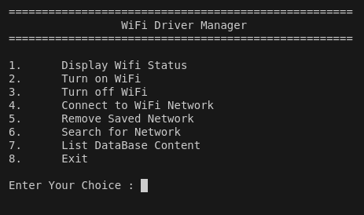
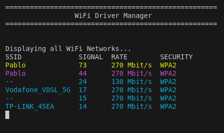
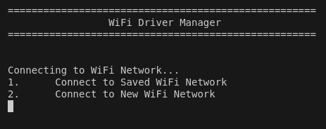
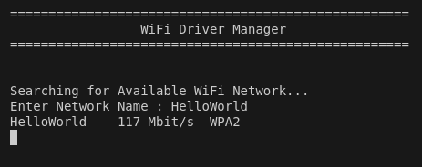
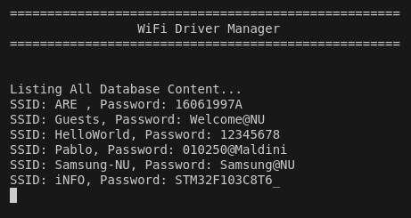

# WiFi Control Program

## Overview

The **WiFi Control Program** is a command-line tool for managing WiFi connections on a Linux system. This program allows users to display WiFi status, enable or disable WiFi connectivity, connect to saved or new WiFi networks, and manage saved networks.

## Features

1. **Display WiFi Status:**
   - Check and display whether WiFi is currently on or off.

2. **Turn WiFi On/Off:**
   - Enable or disable WiFi connectivity using system commands.

3. **Connect to WiFi Network:**
   - **Connect using a Saved Network:** Choose from a list of previously saved networks.
   - **Connect using a New Network:** Enter a new SSID and password to connect and save the network.

4. **Save WiFi Networks:**
   - Store and manage saved networks, including SSID and password.

5. **Optional Features:**
   - **Remove a Saved Network:** Delete a saved network from the list.
   - **Modify a Saved Network:** Update the SSID or password of a saved network.
   - **Search for a Network:** Search for a network by SSID.

## Requirements
- **Operating System: ** Linux
- **Libraries/Tools: ** `nmcli` (NetworkManager Command Line Interface) for network management

## Installation

1. **Clone the Repository:**

   ```bash
   git clone <repository-url>
   cd <repository-directory>

2. **Install Dependencies:**
    Ensure NetworkManager is installed:
   ```bash
   sudo apt-get install network-manager

3. **Compile the Program:**
   Use `g++` to compile:
   ```bash
    g++ -o wifi_control main.cpp

1. **Clone the Repository:**
    Execute the program with root privileges:
   ```bash
   sudo ./wifi_control

## Usage

1. **Display WiFi Status:**
    - Manage Saved Networks:

2. **Turn WiFi On/Off:**
    - Select option 2 to enable WiFi.
    - Select option 3 to disable WiFi.

3. **Connect to WiFi Network:**
    - **Saved Network:** Choose option 4, then select 1 to connect using a saved network. Enter the SSID of the network.
    - **New Network:** Choose option 4, then select 2 to connect using a new network. Enter the SSID and password.

4. **Manage Saved Networks:**
    - **Remove Network:** Select option 5 to delete a saved network. Enter the SSID to remove.
    - **Search for Network:** Select option 6 to search for a network by SSID.
    - **List Database Content:** Select option 7 to list all saved networks.

## Code Structure
- **main.cpp:** Contains the main logic, including menu display and user input handling.
- **wifi.hpp:** Header file declaring functions for WiFi management.
- **wifi.cpp:** Implements WiFi management functions and database operations.

## Functions
- **initializeDatabase():** Loads saved networks from the system connections directory.
- **addNetwork_DB(const std::string& ssid, const std::string& pass):** Adds a network to the saved networks database.
- **retrievNetwork_DB(const std::string& ssid):** Retrieves information about a saved network.
- **listAllNetworks_DB():** Lists all saved networks.
- **displayAllNetworks():** Displays available WiFi networks using nmcli.
- **enableWifiConnectivity():** Turns on WiFi using nmcli.
- **disableWifiConnectivity():** Turns off WiFi using nmcli.
- **getWifiStatus():** Displays the current WiFi status.
- **showActiveAvailableNetworks():** Shows currently active and available networks.
- **connctSavedNetwork(const std::string& ssid):** Connects to a saved network using nmcli.
- **conncetNewWifiNetwork(const std::string& ssid, const std::string& pass):** Connects to a new network and saves it.
- **deleteSavedWifiConnection(const std::string& ssid):** Deletes a saved network.
- **searchForAvailableNetwork(const std::string& ssid):** Searches for networks matching the provided SSID.
- **printTitle():** Prints the menu title.

## Example




