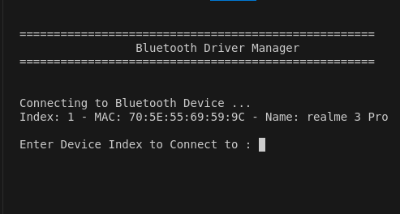

# WiFi/Bluetooth Drivers Controler

## Airplane Mood Controler
### Overview
Here we just as siple as it we turn on/off the **Airplane** Mood

 


## WiFi Driver Controler

### Overview

The **WiFi Control Program** is a command-line tool for managing WiFi connections on a Linux system. This program allows users to display WiFi status, enable or disable WiFi connectivity, connect to saved or new WiFi networks, and manage saved networks.

### Features

1. **Display WiFi Status:**
   - Check and display whether WiFi is currently on or off.

2. **Turn WiFi On/Off:**
   - Enable or disable WiFi connectivity using system commands.

3. **Connect to WiFi Network:**
   - **Connect using a Saved Network:** Choose from a list of previously saved networks.
   - **Connect using a New Network:** Enter a new SSID and password to connect and save the network.

4. **Save WiFi Networks:**
   - Store and manage saved networks, including SSID and password.

5. **Optional Features:**
   - **Remove a Saved Network:** Delete a saved network from the list.
   - **Modify a Saved Network:** Update the SSID or password of a saved network.
   - **Search for a Network:** Search for a network by SSID.

### Requirements
- **Operating System:** Linux
- **Libraries/Tools:** `nmcli` (NetworkManager Command Line Interface) for network management

### Installation

1. **Clone the Repository:**

   ```bash
   git clone <repository-url>
   cd <repository-directory>
2. **Install Dependencies:**
    Ensure NetworkManager is installed:
   ```bash
   sudo apt-get install network-manager
3. **Compile the Program:**
   Use `g++` to compile:
   ```bash
    g++ -o wifi_control main.cpp
1. **Clone the Repository:**
    Execute the program with root privileges:
   ```bash
   sudo ./wifi_control
### Usage

1. **Display WiFi Status:**
    - Manage Saved Networks:

2. **Turn WiFi On/Off:**
    - Select option 2 to enable WiFi.
    - Select option 3 to disable WiFi.

3. **Connect to WiFi Network:**
    - **Saved Network:** Choose option 4, then select 1 to connect using a saved network. Enter the SSID of the network.
    - **New Network:** Choose option 4, then select 2 to connect using a new network. Enter the SSID and password.

4. **Manage Saved Networks:**
    - **Remove Network:** Select option 5 to delete a saved network. Enter the SSID to remove.
    - **Search for Network:** Select option 6 to search for a network by SSID.
    - **List Database Content:** Select option 7 to list all saved networks.

### Code Structure
- **main.cpp:** Contains the main logic, including menu display and user input handling.
- **wifi.hpp:** Header file declaring functions for WiFi management.
- **wifi.cpp:** Implements WiFi management functions and database operations.

### Functions
- **initializeDatabase():** Loads saved networks from the system connections directory.
- **addNetwork_DB(const std::string& ssid, const std::string& pass):** Adds a network to the saved networks database.
- **retrievNetwork_DB(const std::string& ssid):** Retrieves information about a saved network.
- **listAllNetworks_DB():** Lists all saved networks.
- **displayAllNetworks():** Displays available WiFi networks using nmcli.
- **enableWifiConnectivity():** Turns on WiFi using nmcli.
- **disableWifiConnectivity():** Turns off WiFi using nmcli.
- **getWifiStatus():** Displays the current WiFi status.
- **showActiveAvailableNetworks():** Shows currently active and available networks.
- **connctSavedNetwork(const std::string& ssid):** Connects to a saved network using nmcli.
- **conncetNewWifiNetwork(const std::string& ssid, const std::string& pass):** Connects to a new network and saves it.
- **deleteSavedWifiConnection(const std::string& ssid):** Deletes a saved network.
- **searchForAvailableNetwork(const std::string& ssid):** Searches for networks matching the provided SSID.
- **printTitle():** Prints the menu title.

### Example


## Bluetooth Driver Controler

### Overview

This program provides a simple command-line interface to control Bluetooth operations on Linux systems using `bluetoothctl`. It allows users to:

- Check Bluetooth status (enabled or disabled)
- Enable or disable Bluetooth
- Scan for available, connected, or paired devices
- Pair or unpair Bluetooth devices
- Connect or disconnect paired devices

### Requirements

To use this program, you need:

- A Linux operating system with Bluetooth support.
- `bluetoothctl` installed (usually comes pre-installed with most Linux distributions).
- C++ compiler (e.g., `g++`).

### Installation
1. Clone the Repository:
   ```bash
   git clone https://github.com/your-repo/bluetooth-control
   cd bluetooth-control
2. Compile the Program:
   ```bash
   g++ -o bluetooth_control main.cpp bluetooth.cpp -std=c++11
Replace `main.cpp` and `bluetooth.cpp` with the actual names of your source files.

### Usage
- **Run the compiled program from the terminal:**
   ```bash
   ./bluetooth_control
   ```

- **Display Bluetooth Status**

To display the current Bluetooth status (enabled or disabled):
   ```cpp
   bluetoothShowStatus();
   ```

- **Turn Bluetooth On/Off**

To enable Bluetooth:
   ```cpp
   bluetoothPowerOn();
   ```
To disable Bluetooth:
   ```cpp
   bluetoothPowerOff();
   ```
- **Scan for Devices**

To scan for available devices:
   ```cpp
   bluetoothScan(BLUETOOTH_SCAN_AVAILABLE_DEVICES);
   ```
To scan for connected devices:
   ```cpp
   bluetoothScan(BLUETOOTH_SCAN_CONNECTED_DEVICES);
   ```
To scan for paired devices:
   ```cpp
   bluetoothScan(BLUETOOTH_SCAN_PAIRED_DEVICES);
   ```

- **Pair/Unpair Devices**

To pair with a device, provide its MAC address:
   ```cpp
   bluetoothPairDevice("XX:XX:XX:XX:XX:XX");
   ```

To unpair with a device, provide its MAC address:
   ```cpp
   bluetoothUnPairDevice("XX:XX:XX:XX:XX:XX");
   ```

- **Connect/Disconnect Devices**

To connect to a paired device, provide its MAC address:
   ```cpp
   bluetoothConnectDevice("XX:XX:XX:XX:XX:XX");
   ```

To disconnect to a paired device, provide its MAC address:
   ```cpp
   bluetoothDisconnectDevice("XX:XX:XX:XX:XX:XX");
   ```

### Functions Description

1. `execCMD(const char* cmd)`
Executes a system command and returns its output as a string. It throws an error if the command execution fails.

2. `bluetoothGetStatus()`
Gets the Bluetooth status by executing bluetoothctl show and returns whether Bluetooth is "Enabled" or "Disabled."

3. `bluetoothShowStatus()`
Displays the current Bluetooth status to the user.

4. `bluetoothPowerOn()`
Turns Bluetooth on if it is currently disabled.

5. `bluetoothPowerOff()`
Turns Bluetooth off if it is currently enabled.

6. `bluetoothScan(uint8_t cmd)`
Scans for Bluetooth devices based on the provided command (cmd). The command can be to scan available, connected, or paired devices.

7. `bluetoothPairDevice(std::string mac)`
Attempts to pair with a Bluetooth device using its MAC address. Returns true if successful.

8. `bluetoothUnPairDevice(std::string mac)`
Attempts to unpair a Bluetooth device using its MAC address. Returns true if successful.

9. `bluetoothConnectDevice(std::string mac)`
Attempts to connect to a paired Bluetooth device using its MAC address. Returns true if successful.

10. `bluetoothDisconnectDevice(std::string mac)`
Attempts to disconnect from a connected Bluetooth device using its MAC address. Returns true if successful.

11. `printBluetoothTitle()`
Clears the console and prints a title header for the Bluetooth Driver Manager.

### Output





